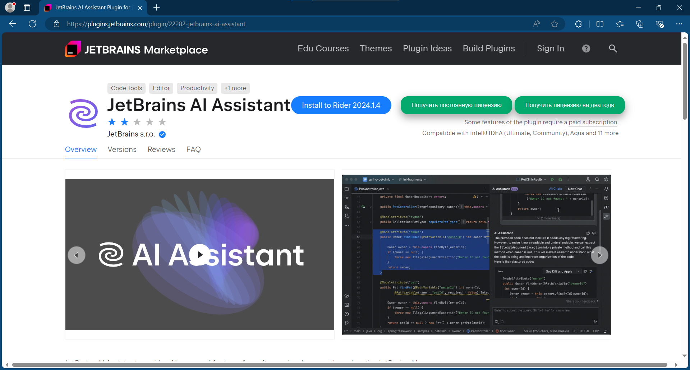

# JBKF

A simple and lightweight browser extension that allows you to generate JetBrains product codes (including plugins)

> NOTE: to install this script, you can use tampermonkey, what located [here](https://www.tampermonkey.net/)

# So how it works

For the first step - we go to [Jetbrains Marketplace](https://plugins.jetbrains.com/)

Search, what you needed, and press the generate button (only if it visible)



If you press the button - script will thrown the allert, with state of current task

if the task successfuly completed - you will got message, what looks like that: "**Copied to clipboard**... etc", and the code, what has been copied looks like that:

```
HTHYUKQX06-eyJsaWNlbnNlSWQiOiJIVEhZVUtRWDA2IiwibGljZW5zZWVOYW1lIjoicmVib3JuIiwiYXNzaWduZWVOYW1lIjoicmVib3JuIiwiYXNzaWduZWVFbWFpbCI6IiIsImxpY2Vuc2VSZXN0cmljdGlvbiI6IiIsImNoZWNrQ29uY3VycmVudFVzZSI6ZmFsc2UsInByb2R1Y3RzIjpbeyJjb2RlIjoiQUlQIiwiZmFsbGJhY2tEYXRlIjoiMjA5OS0wOC0wMSIsInBhaWRVcFRvIjoiMjA5OS0wOC0wMSJ9XSwibWV0YWRhdGEiOiIwMTIwMjMwMTAyUFBBQTAxMzAwOSIsImhhc2giOiI0MTQ3Mjk2MS8wOjE1NjM2MDk0NTEiLCJncmFjZVBlcmlvZERheXMiOjcsImF1dG9Qcm9sb25nYXRlZCI6dHJ1ZSwiaXNBdXRvUHJvbG9uZ2F0ZWQiOnRydWV9-QxX0VGY3d8ahdcuLkZaDkPVUCU7P7X3x2oJ1bEu1vRSqEF0SfAMnN+6K9j3NhDlPa4kC5qT4y5yraQHeQuwFyMZo1atI9d12ZMJ65wB2o/mq/XmwlyxMfUm0xt2nFprN3vvaDz/DphXGXy5vLCSIWGRIdMRHncwqI9LGR1mF1ls2elqef67psJzWfZZwpIEIgExxw7dqgqACfOyW3GDOTVjLRoI4Qx6Jhv8wHo/A0TafGk1YVWVnE971AVzowMHti0aYEx4fYQARPTWQUyFyaukgHMbuHSNaHyXKgBPgH6aJZNKrR6WR7I7Eg9gS7b/9shctro+E//O6MsWYx5v5ePnf1KPeLCg4T8evffjjJ2mvWjAWEib/2GuWda3Pym/OnsXNuCI8ieUdzPygFzGUASEnb2BJOrjrWV/IT86t5nbHibYzLTC/ddVKhiKPkbTG7Be2H5lOIT4zmozuc1vROUw6SedgSJuRds2xSnIzfXAbfn+7NJfqY+xY1J/9jh3YFMf02s3QFjryo4XnVeOe/jSh6Q+6G0XRnemJBVdDx/6cR18Cyvb4fDdQo+phvt+g2yMHFqJj/ni3gi5tQTi88TuODWLbEJTxydwXb7M/cpN280m0qyRdyWA+eZFyV+B816cJaVWzgUBDs4wkxWHhaCY4yZ+RLOaATgbCFk0Sqgs=-MIIEtTCCAp2gAwIBAgIUDyuccmylba71lZQAQic5TJiAhwwwDQYJKoZIhvcNAQELBQAwGDEWMBQGA1UEAwwNSmV0UHJvZmlsZSBDQTAeFw0yMzA5MjkxNDA2MTJaFw0zMzA5MjcxNDA2MTJaMBExDzANBgNVBAMMBk5vdmljZTCCAiIwDQYJKoZIhvcNAQEBBQADggIPADCCAgoCggIBALenqcGP2ZxGkYqmKA9c4Hzf8+YD1smvmOxKjd+bmTLrutM/hXv1cj1rW3/lqyDtdDk7K6W8/TDq1CRrEt+Do6l30DxhAiC34aH8DmGwgq77xEoLimvH5LpePxflF+tbB1RZtFgFDOIYLdSQaKFH2JDgVKxhLiV3S6jniPhkCtWWrTs+E6vq4N15Bm3NnM5AJILqjtUbOjNfaxVq6RrOoTc0R3Fqqo6yvxo/+JYa2UnHIC+r2dbKuDLMUrtgnydEUdJNX0zH9FtcdELvr48uc9mY038TWUsZUK1pnQbxA2bPyA4qnYJ9IvUgO6LtLXvGFm137YQMS1N41AHDBOrwoNI8UoDX+qI3rM96biFOFvn7Edky7rByzybt3H+zxdojfjvpL1E0NO98BT9zfufHAaAxZtlmDOu5LDJe3CGurnyRMRExbtc+Qjl1mUh6tG4lakAwdsoxry0GdG72yaYyb9it53kaFks/T/s7Z7bRJzVFzQDV1Y4bzUtk43vKm2vztBVlQkBkZY5f2Jbe5Ig3b8swQzBnOT0mrL5SPUhwmQ6IxkEWztj55OEujBMmRr92oESuq9ZYMaeLidKWVR3/++HA8BRZaRGEKtSHZCbFEFdihDxxJv9Xh6NuT/ewJ6HYp+0NQpFnUnJ72n8wV+tudpam7aKcdzVmz7cNwOhG2Ls7AgMBAAEwDQYJKoZIhvcNAQELBQADggIBAIdeaQfKni7tXtcywC3zJvGzaaj242pSWB1y40HW8jub0uHjTLsBPX27iA/5rb+rNXtUWX/f2K+DU4IgaIiiHhkDrMsw7pivazqwA9h7/uA0A5nepmTYf/HY4W6P2stbeqInNsFRZXS7Jg4Q5LgEtHKo/H8USjtVw9apmE3BCElkXRuelXMsSllpR/JEVv/8NPLmnHSY02q4KMVW2ozXtaAxSYQmZswyP1YnBcnRukoI4igobpcKQXwGoQCIUlec8LbFXYM9V2eNCwgABqd4r67m7QJq31Y/1TJysQdMH+hoPFy9rqNCxSq3ptpuzcYAk6qVf58PrrYH/6bHwiYPAayvvdzNPOhM9OCwomfcazhK3y7HyS8aBLntTQYFf7vYzZxPMDybYTvJM+ClCNnVD7Q9fttIJ6eMXFsXb8YK1uGNjQW8Y4WHk1MCHuD9ZumWu/CtAhBn6tllTQWwNMaPOQvKf1kr1Kt5etrONY+B6O+Oi75SZbDuGz7PIF9nMPy4WB/8XgKdVFtKJ7/zLIPHgY8IKgbx/VTz6uBhYo8wOf3xzzweMnn06UcfV3JGNvtMuV4vlkZNNxXeifsgzHugCvJX0nybhfBhfIqVyfK6t0eKJqrvp54XFEtJGR+lf3pBfTdcOI6QFEPKGZKoQz8Ck+BC/WBDtbjc/uYKczZ8DKZu
```

And after that step - you can open your favorite JetBrains IDE, and activate your plugin at once.

> "NOTE:" You should install jetbra package, from [original repo](https://github.com/novice88/jetbra)

After all steps to be done - you will enjoy

# Credits

Special thanks to [Novice LI](https://github.com/novice88)
